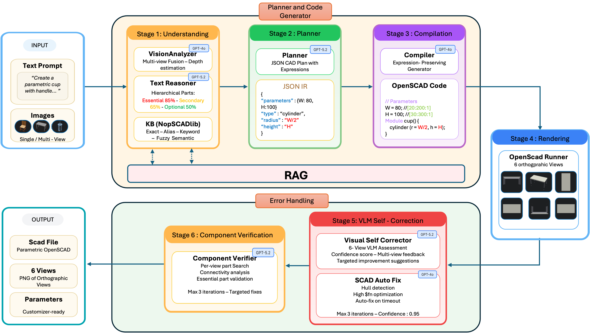

# CRAFT: Corrective and Robust Multi-Agent Framework for Text-to-Parametric CAD

CRAFT is a corrective and robust multi-agent framework for text-to-parametric CAD generation. It produces executable and editable OpenSCAD programs from natural language without task-specific training, through three core mechanisms: a JSON-based intermediate representation that preserves symbolic parametric expressions, multi-view visual feedback to detect and correct geometric errors, and a layered recovery strategy that handles failures at every stage of the pipeline.

<p align="center">
  
</p>

## Repository layout

```
CRAFT/
├── pipeline/              # The method itself — six stages, five recovery layers
│   ├── core/              #   reasoner, planner, compiler, visual corrector, verifier, ...
│   ├── kb/                #   NopSCADlib retrieval (RAG)
│   ├── utils/             #   OpenSCAD runner, parameter parser, image metrics
│   └── app.py             #   optional Flask web demo
│
├── experiments/           # Full reproduction toolkit (run end-to-end)
│   ├── 01_ground_truth/   #   build ground truth for the three datasets
│   ├── 02_benchmark/      #   run methods (CRAFT, baselines, ablations)
│   ├── 03_metrics/        #   score outputs — one self-contained subdir per metric
│   ├── 04_statistics/     #   bootstrap CIs + paired significance tests
│   ├── 05_recovery_stats/ #   per-stage recovery statistics
│   └── 06_tables_and_figures/  # emit paper-ready LaTeX tables
│
├── data/                  # External dataset samples (ABC, Slice-100K) + instructions
├── ground_truth/          # GT renders, GT JSONs, complexity tiers
├── results/               # Generated OpenSCAD programs per dataset/method (.scad + results.json)
├── metrics/               # Computed metric results backing the paper tables
├── paper/ieee_lad_2026/   # LaTeX source, figures, and generated tables
├── additional_study/      # Experiments NOT reported in the paper (see its README)
├── RUNBOOK.md             # Operational notes for running the pipeline at scale
├── requirements.txt
└── LICENSE
```

> **Note on repository weight.** To keep the repository fast to clone, the
> regenerable bulk artifacts — rendered `.png` views and exported `.stl`
> meshes — are not committed. The repository ships the generated OpenSCAD
> programs (`.scad`), per-run metadata (`results.json`), and all computed
> metric JSONs, which together back every number in the paper. Renders and
> meshes are reproduced by running the pipeline (see below).

## Key idea

Supervised methods that fine-tune models on paired text–CAD datasets produce
geometrically plausible outputs within their training distribution but
generalize poorly to novel shapes and require substantial curated data.
Zero-shot prompting avoids this data dependency but is prone to syntactically
invalid code, non-renderable geometry, and outputs that fail to reflect the
prompt. Critically, both families tend to produce hard-coded numeric geometry
rather than editable parametric models, limiting downstream engineering and
customization.

CRAFT addresses these limitations by decomposing CAD generation into six
discrete stages — understanding, planning, compilation, rendering,
self-correction, and verification — each of which can be independently
validated and repaired, so errors are detected and corrected locally rather
than propagating silently into the final output.

## Pipeline

Reasoning-intensive stages (understanding, planning, VLM self-correction, and
component verification) are handled by GPT-5.2; deterministic translation and
repair steps are handled by GPT-4o.

1. **Understanding** — Image and text inputs are processed in parallel. The text path identifies required components, classifies them by importance (essential / secondary / optional), and detects standard parts. Recognized parts are grounded in NopSCADlib specifications via five retrieval strategies (exact, fuzzy, category, dimensional, semantic-embedding).
2. **Planning** — A JSON CAD plan encodes geometry, CSG operations, and *symbolic* parametric expressions in a structured form that is validated before any code is generated. Expressions such as `outer_diameter/2` are carried through unchanged so the final model stays editable.
3. **Compilation** — The validated plan is translated into OpenSCAD that preserves expression strings and generates customizer parameter ranges.
4. **Rendering** — OpenSCAD produces six orthographic views (front, back, left, right, top, bottom), with timeout-aware simplification of expensive constructs such as `hull()`.
5. **VLM Self-Correction** — A vision-language model compares the six-view render against the prompt, returns a confidence score and issue list, and proposes targeted fixes for up to three rounds (early stop at confidence > 0.95).
6. **Component Verification** — Tiered presence checks at 85% / 65% / 50% confidence for essential / secondary / optional parts.

### Layered error recovery

A five-layer strategy ordered from inexpensive structural fixes to costly semantic correction:

1. **Schema Auto-Repair** — JSON schema validation and repair (max 2 retries)
2. **SCAD Auto-Fix** — simplify `hull`/`minkowski`/high-`$fn` constructs and extend timeouts
3. **VLM Correction** — six-view render → GPT-5.2 assessment → LLM fix → iterate (max 3)
4. **Component Verification** — tiered part check → connectivity check → targeted fix (max 3)
5. **Manual Repair** — optional user hint folded into the prompt

Automatic recovery runs under a fixed shared budget of 10 attempts across the first four layers.

## Results

CRAFT is evaluated on three datasets totaling 668 components — NopSCADlib
(468, primary in-domain benchmark), ABC (100), and Slice-100K (100, both
cross-dataset with retrieval disabled). Baselines are single-stage direct
generation with GPT-4o and GPT-5.2 (temperature 0.0, no planning, retrieval,
visual feedback, or recovery).

**Perceptual alignment — NopSCADlib**

| Metric | CRAFT | GPT-4o | GPT-5.2 | Ground Truth |
|--------|:-----:|:------:|:-------:|:------------:|
| CLIP Score ↑ | **0.2226** | 0.2033 | 0.2145 | 0.2342 |
| FID ↓ | **95.11** | 119.42 | 106.22 | — |

**Geometric accuracy — NopSCADlib (overall)**

| Metric | CRAFT | GPT-4o | GPT-5.2 |
|--------|:-----:|:------:|:-------:|
| Chamfer Distance ↓ | **0.0654** | 0.0733 | 0.0662 |
| F1 @ 1% ↑ | 0.2530 | 0.2467 | **0.2587** |
| Voxel IoU ↑ | **0.2356** | 0.2135 | 0.1890 |

**Geometric accuracy — ABC (out-of-domain)**

| Metric | CRAFT | GPT-4o | GPT-5.2 |
|--------|:-----:|:------:|:-------:|
| Chamfer Distance ↓ | **0.0841** | 0.1008 | 0.0969 |
| F1 @ 1% ↑ | **0.1233** | 0.0857 | 0.0875 |
| Voxel IoU ↑ | **0.0433** | 0.0212 | 0.0192 |

**Geometric accuracy — Slice-100K (out-of-domain)**

| Metric | CRAFT | GPT-4o | GPT-5.2 |
|--------|:-----:|:------:|:-------:|
| Chamfer Distance ↓ | **0.0612** | 0.0751 | 0.0622 |
| F1 @ 1% ↑ | **0.2924** | 0.2122 | 0.2768 |
| Voxel IoU ↑ | 0.0616 | **0.0711** | 0.0636 |

**Editability — NopSCADlib**

| Method | Exposed params | Symbolic-preservation ↑ |
|--------|:--------------:|:-----------------------:|
| CRAFT | **13.1** | **66.8%** |
| GPT-5.2 | 4.2 | 47.7% |
| GPT-4o | 0.1 | 3.0% |

CRAFT leads on perceptual fidelity (highest CLIP, lowest overall FID),
volumetric overlap (highest Voxel IoU on NopSCADlib), out-of-domain geometry
(best Chamfer, F1, and Voxel IoU on ABC; best Chamfer and F1 on Slice-100K),
and exposes far more editable parametric structure than direct generation.
A five-way ablation isolates retrieval as the dominant contributor to
in-domain geometric fidelity. Full per-tier tables, the ablation, and
per-stage recovery statistics are in the paper and regenerated by
`experiments/06_tables_and_figures/`.

## Reproducing the paper

The full recipe is in [`experiments/README.md`](experiments/README.md). In brief:

```bash
# 1. Build ground truth (one-time)
python experiments/01_ground_truth/render_nopscadlib.py
python experiments/01_ground_truth/compute_complexity.py
python experiments/01_ground_truth/external_render_views.py --dataset abc
python experiments/01_ground_truth/external_render_views.py --dataset slice100k
python experiments/01_ground_truth/external_gt.py --dataset abc
python experiments/01_ground_truth/external_gt.py --dataset slice100k

# 2. Run methods × datasets (requires an OpenAI API key)
python experiments/02_benchmark/run_craft.py
python experiments/02_benchmark/run_direct_baselines.py
python experiments/02_benchmark/run_external.py --dataset abc      --models craft gpt4o gpt52
python experiments/02_benchmark/run_external.py --dataset slice100k --models craft gpt4o gpt52
python experiments/02_benchmark/run_ablations.py

# 3. Compute metrics, run statistics, emit tables
python experiments/03_metrics/_shared/geometric.py --models ...
python experiments/03_metrics/fid/compute_fid.py   --models ...
python experiments/03_metrics/clip/compute_clip.py --models ...
python experiments/03_metrics/editability/compute_editability.py --scad-dirs ...
python experiments/04_statistics/bootstrap_ci.py && python experiments/04_statistics/paired_tests.py
python experiments/05_recovery_stats/aggregate_recovery.py
python experiments/06_tables_and_figures/generate_all_tables.py --all
```

Each metric has a self-contained `experiments/03_metrics/<metric>/README.md`
documenting its formula, library, inputs, outputs, and exact command.

## Setup

Requirements: Python 3.10+, [OpenSCAD](https://openscad.org/) on `$PATH`, and an OpenAI API key.

```bash
git clone https://github.com/idealab-isu/CRAFT.git
cd CRAFT
pip install -r requirements.txt

# Knowledge base (NopSCADlib retrieval)
git clone https://github.com/nophead/NopSCADlib.git pipeline/kb_data/NopSCADlib
python pipeline/scripts/build_knowledge_base.py
```

Optional interactive demo (not required for paper results):

```bash
export OPENAI_API_KEY=your_key_here
python pipeline/app.py   # open http://localhost:5000
```

## Citation

```bibtex
@inproceedings{craft2026,
  title     = {CRAFT: Corrective and Robust Multi-Agent Framework for Text-to-Parametric CAD},
  author    = {Rafi, Mohammed Musthafa and Jignasu, Anushrut and Saraeian, Mahdi and Hegde, Chinmay and Balu, Aditya and Krishnamurthy, Adarsh},
  booktitle = {IEEE International Conference on LLM-Aided Design (LAD)},
  year      = {2026}
}
```

## License

Released under the MIT License. See [LICENSE](LICENSE).
